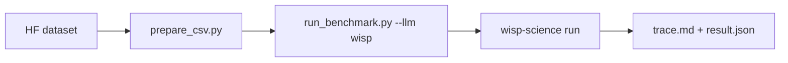

**English** | [中文](README.zh.md) · [↑ wisp-science-benchmark](../README.md)

# Wisp on CompBioBench

This directory **is** the evaluation harness: the Genentech runner (MIT, see `LICENSE.compbiobench-runner`) plus a first-class `wisp` backend. Data still lives outside git.

Scoring is **exact string match** on one line. Do not compare these numbers to BiomniBench-DA (rubric LLM judge).



Copy [`.env.example`](.env.example).

## Layout

| Path | Role |
| --- | --- |
| `run_benchmark.py` | Harness (vendored from [`compbiobench-runner`](https://github.com/Genentech/compbiobench-runner)) + `wisp` in `LLM_PROVIDERS` |
| `wisp_provider.py` / `wisp-run.sh` | Drive `wisp-science run --output jsonl` |
| `prepare_csv.py` | Rewrite `file_paths` to the local data dump |
| `environment.yml` | Base conda env cloned per question |
| [`Genentech/compbiobench-data-v1`](https://huggingface.co/datasets/Genentech/compbiobench-data-v1) | Questions + files (download separately) |
| [`wisp-science`](https://github.com/xuzhougeng/wisp-science) | Agent under test |

---

## Setup

### Dataset (Hugging Face mirror)

```bash
mkdir -p ~/benchmark
cd ~/benchmark
export HF_ENDPOINT=https://hf-mirror.com
# export HF_TOKEN=hf_xxxxxx   # if gated
# huggingface-cli login --token "$HF_TOKEN"

huggingface-cli download Genentech/compbiobench-data-v1 \
  --local-dir ./compbiobench-data \
  --repo-type dataset
```

Expect `compbiobench.v1.tsv` at the dump root and files under `data/`.

### Conda env + Wisp binary

```bash
cd /ABS/PATH/wisp-science-benchmark/compbiobench
conda env create -f environment.yml   # name: compbio-benchmark

export PATH="$HOME/.cargo/bin:$PATH"
cd ~/benchmark/wisp-science   # or your wisp-science tree
cargo build --release -p wisp-cli
```

### Questions CSV

```bash
python prepare_csv.py \
  --data-dir ~/benchmark/compbiobench-data \
  --out benchmark.csv
```

`--strict` exits if any `file_paths` entry is missing.

---

## Run

This script does **not** load `.env`. Source it first. One process, one model (`WISP_MODEL` must equal `-m`).

```bash
cd /ABS/PATH/wisp-science-benchmark/compbiobench
set -a; source .env; set +a

# smoke
python run_benchmark.py run --llm wisp -m "$WISP_MODEL" -i test_benchmark.csv -n 1

# full
python run_benchmark.py run --llm wisp -m "$WISP_MODEL" -i benchmark.csv -n 1 -t 120
```

Start with `-n 1`. Conda clones are expensive.

Wisp is launched by prepending the cloned env’s `bin/` to `PATH` (not `conda run`, which can sit silent for the full `-t`). If the process emits nothing for 180s, the harness kills it and retries once (`BENCH_STARTUP_SILENCE_SEC=0` disables). On a blocked PyPI, set `UV_INDEX_URL` (and `UV_HTTP_TIMEOUT`, default 30 in `wisp-run.sh`).

Resume:

```bash
python run_benchmark.py run --llm wisp -m "$WISP_MODEL" --resume wisp_<model>_<timestamp>
```

Copy finished runs into `reports/<run-id>/` when you want them in git.

### Wisp env vars

Same identity knobs as BiomniBench. Headless `wisp-science` does not use the desktop keyring.

| Variable | Role |
| --- | --- |
| `WISP_BIN` | Absolute path to `wisp-science` |
| `WISP_ROOT` | Source tree (`python/kernel_worker.py`, `skills/`) |
| `WISP_PROVIDER` | Wire protocol: `openai` / `openai_responses` / `anthropic` |
| `WISP_API_URL` | API **root** (Wisp appends the path) |
| `WISP_MODEL` | Model id; must equal `--model` |
| `WISP_API_KEY` | Provider key |
| `WISP_VISION` | `1` to send native image parts |

The harness runs each question under `conda run --live-stream` on a clone of `compbio-benchmark`. Wisp’s **shell** should see that Python. The kernel REPL still uses a per-workspace uv venv (same caveat as BiomniBench-DA).
