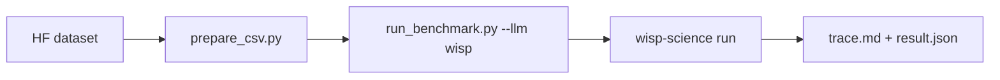

**English** | [中文](README.zh.md) · [↑ wisp-science-benchmark](../README.md)

# Wisp on CompBioBench

This directory **is** the evaluation harness: the Genentech runner (MIT, see `LICENSE.compbiobench-runner`) plus a first-class `wisp` backend. Data still lives outside git.

CompBioBench requires **exact string match** on one line. This runner collects outputs and merges results; it does not grade correctness. Do not compare these numbers to BiomniBench-DA (rubric LLM judge).



Copy [`.env.example`](.env.example).

## Published run results

The [answer table](https://wisp-science.github.io/wisp-science-benchmark/compbiobench/)
contains 100 questions each for GLM-5.3, gpt-5.6-sol, grok-4.6, and kimi-k3,
plus 95 for gpt-6-astra, imported from the 2026-09-07 `archive_clean.zip` update.
GPT-6 Astra's default run configuration skipped 5 questions requiring external
reference resources; the original reasons are retained in the metadata. Rows are
question names, columns are models, and cells are original answers. CSV download
is available. All answers and execution timestamps come from the latest archive;
all 95 GPT-6 Astra records have returned output. The remaining 29 timeouts and
5 skipped cells display `NA`.
Model-authored `NA` answers and one API error remain unchanged. Original errors
are retained in `reports/results.json`.
No correctness grading or performance ranking is applied.

`reports/results.json` retains question text, original answers, statuses, and run
metadata so builds do not need the ZIP. The archive and large execution logs are
excluded from git. The table retains all 100 questions and uses each run's metadata
to distinguish executed questions from declared skips. Unexplained missing results
cause the import to fail.

From the repository root:

```bash
# Import or replace this batch: one run per model, omissions must be declared skips
python compbiobench/reports/build_index.py --archive archive_clean.zip
# Rebuild without the archive
python compbiobench/reports/build_index.py
python compbiobench/reports/test_build_index.py
python compbiobench/test_profiles.py
python compbiobench/test_warmup.py
python compbiobench/reports/test_select_rerun.py
```

Outputs: `docs/compbiobench/index.html` and `docs/compbiobench/answers.csv`.

## Layout

| Path | Role |
| --- | --- |
| `run_benchmark.py` | Harness (vendored from [`compbiobench-runner`](https://github.com/Genentech/compbiobench-runner)) + `wisp` in `LLM_PROVIDERS` |
| `wisp_provider.py` / `wisp-run.sh` | Drive `wisp-science run --output jsonl` |
| `prepare_csv.py` | Rewrite `file_paths` to the local data dump |
| `environment.yml` | Base conda env cloned per question |
| `environment-extras.yml` | Extra tools installed into that env by `warmup` |
| `warmup.py` | Pre-install conda extras; cache genomes, containers, models; network precheck |
| [`Genentech/compbiobench-data-v1`](https://huggingface.co/datasets/Genentech/compbiobench-data-v1) | Questions + files (download separately) |
| [`wisp-science`](https://github.com/xuzhougeng/wisp-science) | Agent under test |

---

## Setup

### Dataset (Hugging Face mirror)

```bash
mkdir -p ~/benchmark
cd ~/benchmark
export HF_ENDPOINT=https://hf-mirror.com
# export HF_TOKEN=hf_xxxxxx   # if gated
# huggingface-cli login --token "$HF_TOKEN"

huggingface-cli download Genentech/compbiobench-data-v1 \
  --local-dir ./compbiobench-data \
  --repo-type dataset
```

Expect `compbiobench.v1.tsv` at the dump root and files under `data/`.

### Conda env + Wisp binary

warmup / the harness locate binaries with `shutil.which()`, **not** `alias conda=mamba` or `alias conda=micromamba`. micromamba’s `shell init` shim at `~/.local/share/mamba/condabin/conda` is treated as classic conda, so warmup adds `--solver libmamba`, fails with `unrecognized arguments: --solver`, then tries to install `conda-libmamba-solver` (a conda plugin; useless on micromamba).

Pick one stack per machine (do not mix miniforge and micromamba). Pin the absolute path:

| Installed | Set `COMPBIO_CONDA_CMD` to |
| --- | --- |
| micromamba | `command -v micromamba` (often `~/.local/bin/micromamba` or `~/.local/share/mamba/micromamba`) |
| miniforge / mamba | `$HOME/miniforge3/bin/mamba` |
| classic conda only | leave unset; first `conda install -n base conda-libmamba-solver -y && conda config --set solver libmamba` |

```bash
# Put in ~/.zshrc (or export before the run). Do not rely on aliases.
export COMPBIO_CONDA_CMD="$(command -v micromamba)"
# e.g. export COMPBIO_CONDA_CMD="$HOME/.local/bin/micromamba"
# e.g. export COMPBIO_CONDA_CMD="$HOME/miniforge3/bin/mamba"

cd /ABS/PATH/wisp-science-benchmark/compbiobench
python3 -c "import conda_cli; print(conda_cli.describe_driver()); print(' '.join(conda_cli.install_command('compbio-benchmark', ['bowtie2'])))"
# OK: "Using micromamba …" or "Using mamba …"; no --solver; CLI is not …/condabin/conda
```

`.condarc` must list conda-forge + bioconda. `defaults` first with `channel_priority: strict` fails or mixed-solves bowtie2 / macs2 / STAR. micromamba reads `~/.condarc` too.

```bash
[ -f ~/.condarc ] && cp ~/.condarc ~/.condarc.bak
```

```yaml
channels:
  - conda-forge
  - bioconda
channel_priority: strict
show_channel_urls: true
```

Optional China mirror (Westlake). Drop the `bioconda` `custom_channels` line if that mirror has no bioconda:

```yaml
default_channels:
  - https://mirrors.westlake.edu.cn/ANACONDA/cloud/conda-forge
custom_channels:
  conda-forge: https://mirrors.westlake.edu.cn/ANACONDA/cloud
  bioconda: https://mirrors.westlake.edu.cn/ANACONDA/cloud
```

Then create the env and warmup:

```bash
cd /ABS/PATH/wisp-science-benchmark/compbiobench
"$COMPBIO_CONDA_CMD" env create -f environment.yml -y   # name: compbio-benchmark
# warmup also creates the base env before extras:
# COMPBIO_CONDA_CMD=… python run_benchmark.py warmup --only conda

# Once per machine: conda extras, Docker/Singularity images, hg38, ENCODE ATAC
# indexes, Hugging Face models. Safe to re-run; complete files/images/tools are skipped.
python run_benchmark.py warmup
# python run_benchmark.py warmup --status
# python run_benchmark.py warmup --only models,conda   # retry only missing steps
# COMPBIO_DOCKER_MIRRORS=docker.m.daocloud.io python run_benchmark.py warmup

export PATH="$HOME/.cargo/bin:$PATH"
cd ~/benchmark/wisp-science   # or your wisp-science tree
cargo build --release -p wisp-cli
```

### Questions CSV

```bash
python prepare_csv.py \
  --data-dir ~/benchmark/compbiobench-data \
  --out benchmark.csv
```

`--strict` exits if any `file_paths` entry is missing.

### Benchmark / Benchmark-full

Both profiles use the already downloaded `compbiobench-data` and the complete `benchmark.csv`. Selection happens before execution. The size of supplied question inputs does not affect selection; the concern is additional external reference databases, genomes, and indexes.

| Profile | Option | Selection |
| --- | --- | --- |
| Benchmark (default) | `--profile default`, optional | Temporarily skip the 5 questions below; selects 95 from a 100-question input |
| Benchmark-full | `--profile full` | Keep all questions in the input CSV |

The initial manual list is in [`FULL_ONLY_QUESTIONS`](run_benchmark.py), based on external resources used by conventional analyses and reported download stalls:

| Full only for now | Additional resources; question inputs are already downloaded |
| --- | --- |
| `contaminated-rna-q1/q2/q3` | Broad taxonomic reference data, such as a Kraken2 database, for unknown contaminants |
| `encode-atac-pipeline-q1` | ENCODE ATAC reference bundle and alignment indexes |
| `find-deletion-q1` | hg38 genome sequence and alignment index |

This provisional list does not claim that every solution requires large downloads, or that the default profile is offline or timeout-free. `pooled-infer-donors-q1`, `tissue-fibroblast-q1`, and `odd-one-out-q1` remain in default because their BAM/RDS/archives are supplied. API queries, metadata retrieval, long computation, and installation waits are not automatic exclusion criteria. Extend the list after reviewing raw tool calls, independently of a model's correctness or timeout outcomes.

Preview selection without starting a model or creating Conda environments:

```bash
python run_benchmark.py run --llm wisp -i benchmark.csv --list-questions
python run_benchmark.py run --llm wisp -i benchmark.csv --profile full --list-questions
```

This is a local subset, not a new official CompBioBench release. Run directory names include the profile; `run_metadata.json` records the profile, membership version, selected IDs, skip reasons, and actual question count. Report the profiles separately. Profile exclusions are not model failures. `--exclude` still supports additional exclusions, which change the evaluated population.

---

## Run

This script does **not** load `.env`. Source it first. One process, one model (`WISP_MODEL` must equal `-m`).

```bash
cd /ABS/PATH/wisp-science-benchmark/compbiobench
set -a; source .env; set +a

# smoke
python run_benchmark.py run --llm wisp -m "$WISP_MODEL" -i test_benchmark.csv -n 1

# Benchmark: skip the 5 external-reference questions above
python run_benchmark.py run --llm wisp -m "$WISP_MODEL" -i benchmark.csv -n 1 -t 120

# Benchmark-full: include those questions
python run_benchmark.py run --llm wisp -m "$WISP_MODEL" -i benchmark.csv -n 1 -t 120 --profile full
```

Start with `-n 1`. Conda clones are expensive.

`run` probes ENCODE, Hugging Face, NCBI, GEO, and EBI, then mounts `$COMPBIO_CACHE_DIR` into each workspace as `local_cache/` and points Hugging Face / Singularity env vars at it. The prompt tells the agent to use that cache before downloading. `--skip-network-check` skips the probes. `--cache-dir` overrides the location (default `~/benchmark/compbiobench-cache`).

Wisp is launched by prepending the cloned env’s `bin/` to `PATH` (not `conda run`, which can sit silent for the full `-t`). If the process emits nothing for 180s, the harness kills it and retries once (`BENCH_STARTUP_SILENCE_SEC=0` disables). On a blocked PyPI, set `UV_INDEX_URL` (and `UV_HTTP_TIMEOUT`, default 30 in `wisp-run.sh`).

Resume:

```bash
python run_benchmark.py run --llm wisp -m "$WISP_MODEL" --resume wisp_<model>_<timestamp>
```

Use the actual directory name when resuming. Omitting `--profile` inherits the
profile in metadata; legacy runs without a profile are treated as full. An existing
default run can expand in place with `--profile full`: successful results are kept,
errors and missing results are retried, and previously skipped questions are added
(subject to any explicit `--exclude` in the new command).

```bash
python run_benchmark.py run --llm wisp -m "$WISP_MODEL" -i benchmark.csv \
  --resume wisp_<model>_default_<timestamp> --profile full
```

The directory name stays unchanged. `run_metadata.json` is updated to full with the
selected question set, even if no questions need execution; later resumes and merges
use that metadata. Narrowing full back to default requires a new run. A changed
default membership version still blocks default-to-default resume, but explicit
expansion to full is allowed.

To force only specific questions to run again, including previously successful ones:

```bash
python run_benchmark.py run --llm wisp -m "$WISP_MODEL" -i benchmark.csv \
  --resume wisp_<model>_<timestamp> --rerun gene-pair-ordering-fraction-q1
```

Questions where fewer than 3 of the 5 models share a completed answer (timeouts,
errors, skips, and `ERROR:` outputs do not count), plus the five default-profile
skips (`contaminated-rna-q1/q2/q3`, `encode-atac-pipeline-q1`, `find-deletion-q1`)
even when 3+ models already agree, are listed in
[`reports/rerun_questions.txt`](reports/rerun_questions.txt). Rebuild after importing
new results:

```bash
python reports/select_rerun.py
python reports/test_select_rerun.py
python run_benchmark.py run --llm wisp -m "$WISP_MODEL" -i benchmark.csv \
  --resume wisp_<model>_<timestamp> --profile full \
  --rerun-file reports/rerun_questions.txt
```

Separate multiple IDs with spaces, e.g. `--rerun covid-patient-q1 lung-cancer-sc-q1`.
Only these questions execute and replace their existing results and logs; all other
successful, failed, or missing questions are left alone. Metadata retains the full
selected population and records this invocation's targets in `rerun_question_ids`.
IDs must exist and be selected by the profile and `--exclude`; add `--profile full`
for full-only questions. Add `--list-questions` for an offline preview, or
`--resume-clean-workspace` to clear only the target questions' old workspaces.

Merge profiles separately to keep result populations separate:

```bash
python run_benchmark.py merge -i benchmark.csv --profile default -o benchmark_results.csv
python run_benchmark.py merge -i benchmark.csv --profile full -o benchmark_results-full.csv
```

`merge` only reads matching profiles and default membership versions. Use `--profile full` for legacy results.

The `[DONE]` log label (previously `[OK]`) only means an output was returned without an `ERROR` label. It does not mean the answer is correct. `status: success` in `result.json` is also an execution status; text such as "Safest next action" can still be recorded as an output. Correctness requires a separate comparison with reference answers. Wisp has no configured model pricing, so `$0.0000` does not establish that API calls were free.

Copy finished runs into `reports/<run-id>/` when you want them in git.

### Wisp env vars

Same identity knobs as BiomniBench. Headless `wisp-science` does not use the desktop keyring.

| Variable | Role |
| --- | --- |
| `WISP_BIN` | Absolute path to `wisp-science` |
| `WISP_ROOT` | Source tree (`python/kernel_worker.py`, `skills/`) |
| `WISP_PROVIDER` | Wire protocol: `openai` / `openai_responses` / `anthropic` |
| `WISP_API_URL` | API **root** (Wisp appends the path) |
| `WISP_MODEL` | Model id; must equal `--model` |
| `WISP_API_KEY` | Provider key |
| `WISP_VISION` | `1` to send native image parts |

The harness clones `compbio-benchmark` per question. Wisp uses the clone through `PATH`; other backends use `conda run --live-stream` (or `micromamba run` when conda is absent). The kernel REPL still uses a per-workspace uv venv (same caveat as BiomniBench-DA). Solver selection is under “Conda env” above. micromamba clones via `--clone` when available, otherwise a hard-link copy of the env prefix.
