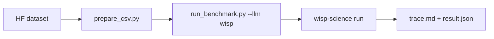

**English** | [中文](README.zh.md) · [↑ wisp-science-benchmark](../README.md)

# Wisp on CompBioBench

This directory **is** the evaluation harness: the Genentech runner (MIT, see `LICENSE.compbiobench-runner`) plus a first-class `wisp` backend. Data still lives outside git.

CompBioBench requires **exact string match** on one line. This runner collects outputs and merges results; it does not grade correctness. Do not compare these numbers to BiomniBench-DA (rubric LLM judge).



Copy [`.env.example`](.env.example).

## Layout

| Path | Role |
| --- | --- |
| `run_benchmark.py` | Harness (vendored from [`compbiobench-runner`](https://github.com/Genentech/compbiobench-runner)) + `wisp` in `LLM_PROVIDERS` |
| `wisp_provider.py` / `wisp-run.sh` | Drive `wisp-science run --output jsonl` |
| `prepare_csv.py` | Rewrite `file_paths` to the local data dump |
| `environment.yml` | Base conda env cloned per question |
| [`Genentech/compbiobench-data-v1`](https://huggingface.co/datasets/Genentech/compbiobench-data-v1) | Questions + files (download separately) |
| [`wisp-science`](https://github.com/xuzhougeng/wisp-science) | Agent under test |

---

## Setup

### Dataset (Hugging Face mirror)

```bash
mkdir -p ~/benchmark
cd ~/benchmark
export HF_ENDPOINT=https://hf-mirror.com
# export HF_TOKEN=hf_xxxxxx   # if gated
# huggingface-cli login --token "$HF_TOKEN"

huggingface-cli download Genentech/compbiobench-data-v1 \
  --local-dir ./compbiobench-data \
  --repo-type dataset
```

Expect `compbiobench.v1.tsv` at the dump root and files under `data/`.

### Conda env + Wisp binary

```bash
cd /ABS/PATH/wisp-science-benchmark/compbiobench
conda env create -f environment.yml   # name: compbio-benchmark

export PATH="$HOME/.cargo/bin:$PATH"
cd ~/benchmark/wisp-science   # or your wisp-science tree
cargo build --release -p wisp-cli
```

### Questions CSV

```bash
python prepare_csv.py \
  --data-dir ~/benchmark/compbiobench-data \
  --out benchmark.csv
```

`--strict` exits if any `file_paths` entry is missing.

### Benchmark / Benchmark-full

Both profiles use the already downloaded `compbiobench-data` and the complete `benchmark.csv`. Selection happens before execution. The size of supplied question inputs does not affect selection; the concern is additional external reference databases, genomes, and indexes.

| Profile | Option | Selection |
| --- | --- | --- |
| Benchmark (default) | `--profile default`, optional | Temporarily skip the 5 questions below; selects 95 from a 100-question input |
| Benchmark-full | `--profile full` | Keep all questions in the input CSV |

The initial manual list is in [`FULL_ONLY_QUESTIONS`](run_benchmark.py), based on external resources used by conventional analyses and reported download stalls:

| Full only for now | Additional resources; question inputs are already downloaded |
| --- | --- |
| `contaminated-rna-q1/q2/q3` | Broad taxonomic reference data, such as a Kraken2 database, for unknown contaminants |
| `encode-atac-pipeline-q1` | ENCODE ATAC reference bundle and alignment indexes |
| `find-deletion-q1` | hg38 genome sequence and alignment index |

This provisional list does not claim that every solution requires large downloads, or that the default profile is offline or timeout-free. `pooled-infer-donors-q1`, `tissue-fibroblast-q1`, and `odd-one-out-q1` remain in default because their BAM/RDS/archives are supplied. API queries, metadata retrieval, long computation, and installation waits are not automatic exclusion criteria. Extend the list after reviewing raw tool calls, independently of a model's correctness or timeout outcomes.

Preview selection without starting a model or creating Conda environments:

```bash
python run_benchmark.py run --llm wisp -i benchmark.csv --list-questions
python run_benchmark.py run --llm wisp -i benchmark.csv --profile full --list-questions
```

This is a local subset, not a new official CompBioBench release. Run directory names include the profile; `run_metadata.json` records the profile, membership version, selected IDs, skip reasons, and actual question count. Report the profiles separately. Profile exclusions are not model failures. `--exclude` still supports additional exclusions, which change the evaluated population.

---

## Run

This script does **not** load `.env`. Source it first. One process, one model (`WISP_MODEL` must equal `-m`).

```bash
cd /ABS/PATH/wisp-science-benchmark/compbiobench
set -a; source .env; set +a

# smoke
python run_benchmark.py run --llm wisp -m "$WISP_MODEL" -i test_benchmark.csv -n 1

# Benchmark: skip the 5 external-reference questions above
python run_benchmark.py run --llm wisp -m "$WISP_MODEL" -i benchmark.csv -n 1 -t 120

# Benchmark-full: include those questions
python run_benchmark.py run --llm wisp -m "$WISP_MODEL" -i benchmark.csv -n 1 -t 120 --profile full
```

Start with `-n 1`. Conda clones are expensive.

Wisp is launched by prepending the cloned env’s `bin/` to `PATH` (not `conda run`, which can sit silent for the full `-t`). If the process emits nothing for 180s, the harness kills it and retries once (`BENCH_STARTUP_SILENCE_SEC=0` disables). On a blocked PyPI, set `UV_INDEX_URL` (and `UV_HTTP_TIMEOUT`, default 30 in `wisp-run.sh`).

Resume:

```bash
python run_benchmark.py run --llm wisp -m "$WISP_MODEL" --resume wisp_<model>_<timestamp>
```

Use the actual directory name when resuming. Resume inherits the original profile; legacy runs without a profile are treated as full. Switching profiles or resuming a default run after its membership version changes requires a new run.

Merge profiles separately to keep result populations separate:

```bash
python run_benchmark.py merge -i benchmark.csv --profile default -o benchmark_results.csv
python run_benchmark.py merge -i benchmark.csv --profile full -o benchmark_results-full.csv
```

`merge` only reads matching profiles and default membership versions. Use `--profile full` for legacy results.

The `[DONE]` log label (previously `[OK]`) only means an output was returned without an `ERROR` label. It does not mean the answer is correct. `status: success` in `result.json` is also an execution status; text such as "Safest next action" can still be recorded as an output. Correctness requires a separate comparison with reference answers. Wisp has no configured model pricing, so `$0.0000` does not establish that API calls were free.

Copy finished runs into `reports/<run-id>/` when you want them in git.

### Wisp env vars

Same identity knobs as BiomniBench. Headless `wisp-science` does not use the desktop keyring.

| Variable | Role |
| --- | --- |
| `WISP_BIN` | Absolute path to `wisp-science` |
| `WISP_ROOT` | Source tree (`python/kernel_worker.py`, `skills/`) |
| `WISP_PROVIDER` | Wire protocol: `openai` / `openai_responses` / `anthropic` |
| `WISP_API_URL` | API **root** (Wisp appends the path) |
| `WISP_MODEL` | Model id; must equal `--model` |
| `WISP_API_KEY` | Provider key |
| `WISP_VISION` | `1` to send native image parts |

The harness clones `compbio-benchmark` per question. Wisp uses the clone through `PATH`; other backends use `conda run --live-stream`. The kernel REPL still uses a per-workspace uv venv (same caveat as BiomniBench-DA).
