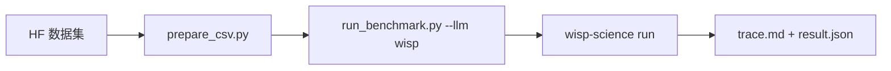

[English](README.md) | **中文** · [↑ wisp-science-benchmark](../README.zh.md)

# Wisp 在 CompBioBench 上的评测

本目录 **就是** 评测体系：Genentech runner（MIT，见 `LICENSE.compbiobench-runner`）加上一等公民 `wisp` backend。数据仍放在 git 外面。

评分是 **单行 exact string match**，不能和 BiomniBench-DA 的 rubric LLM judge 横比。



环境变量模板见 [`.env.example`](.env.example)。

## 布局

| 路径 | 角色 |
| --- | --- |
| `run_benchmark.py` | Harness（从 [`compbiobench-runner`](https://github.com/Genentech/compbiobench-runner) 搬来）+ `LLM_PROVIDERS` 里的 `wisp` |
| `wisp_provider.py` / `wisp-run.sh` | 驱动 `wisp-science run --output jsonl` |
| `prepare_csv.py` | 把 `file_paths` 改成本地数据目录 |
| `environment.yml` | 每题 clone 的基础 conda 环境 |
| [`Genentech/compbiobench-data-v1`](https://huggingface.co/datasets/Genentech/compbiobench-data-v1) | 题目 + 数据文件（另外下载） |
| [`wisp-science`](https://github.com/xuzhougeng/wisp-science) | 被测 agent |

---

## 准备

### 数据集（Hugging Face 镜像）

```bash
mkdir -p ~/benchmark
cd ~/benchmark
export HF_ENDPOINT=https://hf-mirror.com
# export HF_TOKEN=hf_xxxxxx   # 若 gated
# huggingface-cli login --token "$HF_TOKEN"

huggingface-cli download Genentech/compbiobench-data-v1 \
  --local-dir ./compbiobench-data \
  --repo-type dataset
```

根目录应有 `compbiobench.v1.tsv`，文件在 `data/`。

### conda 环境 + Wisp 二进制

```bash
cd /ABS/PATH/wisp-science-benchmark/compbiobench
conda env create -f environment.yml   # 名字：compbio-benchmark

export PATH="$HOME/.cargo/bin:$PATH"
cd ~/benchmark/wisp-science
cargo build --release -p wisp-cli
```

### 题目 CSV

```bash
python prepare_csv.py \
  --data-dir ~/benchmark/compbiobench-data \
  --out benchmark.csv
```

`--strict` 在缺文件时退出。

---

## 跑

脚本 **不加载** `.env`，先 source。一个进程一个模型（`WISP_MODEL` 必须等于 `-m`）。

```bash
cd /ABS/PATH/wisp-science-benchmark/compbiobench
set -a; source .env; set +a

# 冒烟
python run_benchmark.py run --llm wisp -m "$WISP_MODEL" -i test_benchmark.csv -n 1

# 全量
python run_benchmark.py run --llm wisp -m "$WISP_MODEL" -i benchmark.csv -n 1 -t 120
```

先 `-n 1`。conda clone 很重。

续跑：

```bash
python run_benchmark.py run --llm wisp -m "$WISP_MODEL" --resume wisp_<model>_<timestamp>
```

跑完可以把 run 目录拷进 `reports/<run-id>/`。

### Wisp 环境变量

和 BiomniBench 同一套。Headless 不走桌面密钥环。

| 变量 | 作用 |
| --- | --- |
| `WISP_BIN` | `wisp-science` 的绝对路径 |
| `WISP_ROOT` | 源码树（`python/kernel_worker.py`、`skills/`） |
| `WISP_PROVIDER` | 线协议：`openai` / `openai_responses` / `anthropic` |
| `WISP_API_URL` | API **根地址**（Wisp 自己补路径） |
| `WISP_MODEL` | 模型 ID，必须等于 `--model` |
| `WISP_API_KEY` | 服务商 key |
| `WISP_VISION` | `1` = 发送原生图片 part |

Harness 每题用 `conda run --live-stream` 跑 clone 出来的 `compbio-benchmark`。Wisp 的 **shell** 应能用到这份 Python。Kernel REPL 仍是每题 uv venv（和 BiomniBench-DA 一样）。
