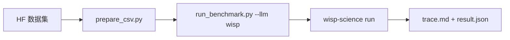

[English](README.md) | **中文** · [↑ wisp-science-benchmark](../README.zh.md)

# Wisp 在 CompBioBench 上的评测

本目录 **就是** 评测体系：Genentech runner（MIT，见 `LICENSE.compbiobench-runner`）加上一等公民 `wisp` backend。数据仍放在 git 外面。

CompBioBench 要求 **单行 exact string match**；本 runner 负责收集输出和合并结果，未实现正确性评分。不能和 BiomniBench-DA 的 rubric LLM judge 横比。



环境变量模板见 [`.env.example`](.env.example)。

## 已整理的运行结果

[在线答案表](https://wisp-science.github.io/wisp-science-benchmark/compbiobench/) 来自
2026-09-07 更新的 `archive_clean.zip`，包含 GLM-5.3、gpt-5.6-sol、grok-4.6、kimi-k3
各 100 题，以及 gpt-6-astra 的 95 题，共 495 条运行记录。gpt-6-astra 的 default
配置因外部参考数据依赖预先跳过了 5 题，原始跳过原因保存在结果元数据中。
全部答案和运行时间均来自最新压缩包，其中 gpt-6-astra 的 95 条记录均已返回输出。
行是原始题目名称，列是模型，单元格是答案，支持下载 CSV。当前 29 条 timeout
和 5 格未运行显示为 `NA`；模型本身输出的 `NA` 和 1 条 API 中断错误保留原样。
原始错误信息仍保存在 `reports/results.json` 中。
未进行正确性评分，也不按答案排序模型。

`reports/results.json` 保存题干、原始答案、运行状态和来源元数据，足够独立重建网页。
压缩包和大体积执行日志不提交。答案表保留完整的 100 题，按每个 run 的元数据区分已运行与预先跳过；未被元数据说明的缺失结果会令导入失败。

在仓库根目录运行：

```bash
# 首次导入或替换本批结果；每个模型只选择一个 run，缺失题目须由跳过元数据说明
python compbiobench/reports/build_index.py --archive archive_clean.zip
# 后续构建无需压缩包
python compbiobench/reports/build_index.py
python compbiobench/reports/test_build_index.py
python compbiobench/test_profiles.py
python compbiobench/test_warmup.py
python compbiobench/reports/test_select_rerun.py
```

输出为 `docs/compbiobench/index.html` 和 `docs/compbiobench/answers.csv`。

## 布局

| 路径 | 角色 |
| --- | --- |
| `run_benchmark.py` | Harness（从 [`compbiobench-runner`](https://github.com/Genentech/compbiobench-runner) 搬来）+ `LLM_PROVIDERS` 里的 `wisp` |
| `wisp_provider.py` / `wisp-run.sh` | 驱动 `wisp-science run --output jsonl` |
| `prepare_csv.py` | 把 `file_paths` 改成本地数据目录 |
| `environment.yml` | 每题 clone 的基础 conda 环境 |
| `environment-extras.yml` | 由 `warmup` 装进该环境的额外工具 |
| `warmup.py` | 预装 conda extras、缓存基因组/容器/模型，并做网络预检 |
| [`Genentech/compbiobench-data-v1`](https://huggingface.co/datasets/Genentech/compbiobench-data-v1) | 题目 + 数据文件（另外下载） |
| [`wisp-science`](https://github.com/xuzhougeng/wisp-science) | 被测 agent |

---

## 准备

### 数据集（Hugging Face 镜像）

```bash
mkdir -p ~/benchmark
cd ~/benchmark
export HF_ENDPOINT=https://hf-mirror.com
# export HF_TOKEN=hf_xxxxxx   # 若 gated
# huggingface-cli login --token "$HF_TOKEN"

huggingface-cli download Genentech/compbiobench-data-v1 \
  --local-dir ./compbiobench-data \
  --repo-type dataset
```

根目录应有 `compbiobench.v1.tsv`，文件在 `data/`。

### conda 环境 + Wisp 二进制

warmup / harness 用 `shutil.which()` 找二进制，**不读** `alias conda=mamba` 或 `alias conda=micromamba`。micromamba `shell init` 生成的 `~/.local/share/mamba/condabin/conda` 会被当成经典 conda，warmup 会加上 `--solver libmamba`，于是报 `unrecognized arguments: --solver`，再去装对 micromamba 无用的 `conda-libmamba-solver`。

每台机器只选一套（不要 miniforge 和 micromamba 混用），用 `COMPBIO_CONDA_CMD` 钉死绝对路径：

| 本机有什么 | `COMPBIO_CONDA_CMD` |
| --- | --- |
| micromamba | `command -v micromamba`（常见 `~/.local/bin/micromamba` 或 `~/.local/share/mamba/micromamba`） |
| miniforge / mamba | `$HOME/miniforge3/bin/mamba` |
| 只有经典 conda | 不设；先 `conda install -n base conda-libmamba-solver -y && conda config --set solver libmamba` |

```bash
# 写入 ~/.zshrc（或评测前 export），不要依赖 alias
export COMPBIO_CONDA_CMD="$(command -v micromamba)"
# 例：export COMPBIO_CONDA_CMD="$HOME/.local/bin/micromamba"
# 例：export COMPBIO_CONDA_CMD="$HOME/miniforge3/bin/mamba"

cd /ABS/PATH/wisp-science-benchmark/compbiobench
python3 -c "import conda_cli; print(conda_cli.describe_driver()); print(' '.join(conda_cli.install_command('compbio-benchmark', ['bowtie2'])))"
# 合格：Using micromamba … 或 Using mamba …；命令里没有 --solver，CLI 不是 …/condabin/conda
```

`.condarc` 必须是 conda-forge + bioconda。`defaults` 排第一且 `channel_priority: strict` 时，bowtie2 / macs2 / STAR 等会解失败或混装。micromamba 同样读 `~/.condarc`。

```bash
[ -f ~/.condarc ] && cp ~/.condarc ~/.condarc.bak
```

```yaml
channels:
  - conda-forge
  - bioconda
channel_priority: strict
show_channel_urls: true
```

国内镜像可再加（西交大；镜像没有 bioconda 就删掉 `custom_channels` 里对应一行）：

```yaml
default_channels:
  - https://mirrors.westlake.edu.cn/ANACONDA/cloud/conda-forge
custom_channels:
  conda-forge: https://mirrors.westlake.edu.cn/ANACONDA/cloud
  bioconda: https://mirrors.westlake.edu.cn/ANACONDA/cloud
```

然后建环境和 warmup：

```bash
cd /ABS/PATH/wisp-science-benchmark/compbiobench
"$COMPBIO_CONDA_CMD" env create -f environment.yml -y   # 名字：compbio-benchmark
# warmup 也会在 extras 之前创建 base env，可直接：
# COMPBIO_CONDA_CMD=… python run_benchmark.py warmup --only conda

# 每台机器跑一次：conda extras、Docker/Singularity 镜像、hg38、ENCODE ATAC
# 索引、Hugging Face 模型。可重复执行，已下完/装完的会跳过。
python run_benchmark.py warmup
# python run_benchmark.py warmup --status
# python run_benchmark.py warmup --only models,conda   # 只重试缺的步骤
# COMPBIO_DOCKER_MIRRORS=docker.m.daocloud.io python run_benchmark.py warmup

export PATH="$HOME/.cargo/bin:$PATH"
cd ~/benchmark/wisp-science
cargo build --release -p wisp-cli
```

### 题目 CSV

```bash
python prepare_csv.py \
  --data-dir ~/benchmark/compbiobench-data \
  --out benchmark.csv
```

`--strict` 在缺文件时退出。

### Benchmark / Benchmark-full

两档共用已下载的 `compbiobench-data` 和完整的 `benchmark.csv`，在运行前筛选题目。已有题目输入的大小不影响筛选；关注的是输入之外还需要获取的大型参考数据库、参考基因组和索引。

| 档位 | 参数 | 范围 |
| --- | --- | --- |
| Benchmark（默认） | `--profile default`，可省略 | 暂时跳过下面 5 题；100 题输入会选中 95 题 |
| Benchmark-full | `--profile full` | 保留输入 CSV 中全部题目 |

第一版人工名单保存在 [`FULL_ONLY_QUESTIONS`](run_benchmark.py)，按常规分析所需的外部资源和已有下载阻塞记录划分：

| 暂时仅在 full 运行 | 额外资源；题目输入已下载 |
| --- | --- |
| `contaminated-rna-q1/q2/q3` | 未知污染物分类所用的综合参考库，例如 Kraken2 数据库 |
| `encode-atac-pipeline-q1` | ENCODE ATAC 管线的参考数据包和比对索引 |
| `find-deletion-q1` | hg38 基因组序列和比对索引 |

这是一份暂定的资源筛选名单，不代表这些题的所有解法都必须下载大文件，也不保证默认集完全离线或不会超时。`pooled-infer-donors-q1`、`tissue-fibroblast-q1`、`odd-one-out-q1` 的 BAM/RDS/压缩包已经提供，保留在默认集；API 查询、元数据检索、长计算和安装等待不作为自动排除理由。后续需核对原始工具调用再扩充名单，不根据某个模型是否答对或超时来选题。

只预览名单，不启动模型、不创建 Conda 环境：

```bash
python run_benchmark.py run --llm wisp -i benchmark.csv --list-questions
python run_benchmark.py run --llm wisp -i benchmark.csv --profile full --list-questions
```

这是本仓库定义的子集，不是官方 CompBioBench 新版本。结果目录名包含 profile；`run_metadata.json` 记录 profile、名单版本、选中 ID、跳过理由及实际题数。两档应分别报告，默认集跳过的题不计为模型失败。`--exclude` 仍可额外排除题目，但会改变实际评测范围。

---

## 跑

脚本 **不加载** `.env`，先 source。一个进程一个模型（`WISP_MODEL` 必须等于 `-m`）。

```bash
cd /ABS/PATH/wisp-science-benchmark/compbiobench
set -a; source .env; set +a

# 冒烟
python run_benchmark.py run --llm wisp -m "$WISP_MODEL" -i test_benchmark.csv -n 1

# Benchmark：默认跳过上面的 5 道外部参考数据题
python run_benchmark.py run --llm wisp -m "$WISP_MODEL" -i benchmark.csv -n 1 -t 120

# Benchmark-full：包含这些题目
python run_benchmark.py run --llm wisp -m "$WISP_MODEL" -i benchmark.csv -n 1 -t 120 --profile full
```

先 `-n 1`。conda clone 很重。

`run` 会预检 ENCODE、Hugging Face、NCBI、GEO、EBI，并把 `$COMPBIO_CACHE_DIR` 挂进每题工作区的 `local_cache/`，同时把 Hugging Face / Singularity 的环境变量指到这份缓存。prompt 会要求模型先用缓存、再上网。`--skip-network-check` 跳过预检。`--cache-dir` 覆盖默认路径（`~/benchmark/compbiobench-cache`）。

Wisp 用克隆环境的 `bin/` 拼进 `PATH` 启动（不用 `conda run`，后者可能整段 `-t` 都零输出）。进程 180 秒没有任何输出会被杀掉并重试一次（`BENCH_STARTUP_SILENCE_SEC=0` 关闭）。PyPI 不通时设 `UV_INDEX_URL`（`wisp-run.sh` 里 `UV_HTTP_TIMEOUT` 默认 30）。

续跑：

```bash
python run_benchmark.py run --llm wisp -m "$WISP_MODEL" --resume wisp_<model>_<timestamp>
```

续跑使用实际目录名，不指定 `--profile` 时继承元数据中的 profile；旧版没有 profile 的运行按 full 处理。
已有 default 运行可加 `--profile full` 原地扩展：保留成功结果，重跑错误或缺失结果，并补跑原先跳过的题目（仍遵守本次显式指定的 `--exclude`）。

```bash
python run_benchmark.py run --llm wisp -m "$WISP_MODEL" -i benchmark.csv \
  --resume wisp_<model>_default_<timestamp> --profile full
```

目录名不变，`run_metadata.json` 会更新为 full，记录完整的选题范围；后续续跑和合并以元数据为准。
即使没有待跑题，也会保存 profile 更新。不能把 full 原地缩回 default，应新建运行。
默认名单版本变化时，继续以 default 续跑仍需新建运行，但可显式扩展为 full。

只重跑指定题目（即使此前已成功），使用 `--resume` 配合 `--rerun`：

```bash
python run_benchmark.py run --llm wisp -m "$WISP_MODEL" -i benchmark.csv \
  --resume wisp_<model>_<timestamp> --rerun gene-pair-ordering-fraction-q1
```

5 个模型里完成答案相同的不到 3 个（超时、报错、跳过、`ERROR:` 不算完成）的题目，
以及默认 profile 跳过的 5 题（`contaminated-rna-q1/q2/q3`、`encode-atac-pipeline-q1`、
`find-deletion-q1`，即使已经 3 个以上模型一致），记在
[`reports/rerun_questions.txt`](reports/rerun_questions.txt)。导入新结果后重新生成：

```bash
python reports/select_rerun.py
python reports/test_select_rerun.py
python run_benchmark.py run --llm wisp -m "$WISP_MODEL" -i benchmark.csv \
  --resume wisp_<model>_<timestamp> --profile full \
  --rerun-file reports/rerun_questions.txt
```

可用空格指定多题，如 `--rerun covid-patient-q1 lung-cancer-sc-q1`。
本次只执行这些题目，并覆盖它们原位置的结果和日志；其他成功、失败或缺失题目不变。
元数据中的完整选题范围保持不变，另用 `rerun_question_ids` 记录本次重跑目标。
题目 ID 必须存在且属于当前 profile、未被 `--exclude` 排除；重跑 full-only 题可加 `--profile full`。
可加 `--list-questions` 离线预览目标；需要清理目标题目的旧工作目录时，加 `--resume-clean-workspace`。

分别合并两档，避免混用题目分母和结果：

```bash
python run_benchmark.py merge -i benchmark.csv --profile default -o benchmark_results.csv
python run_benchmark.py merge -i benchmark.csv --profile full -o benchmark_results-full.csv
```

`merge` 只读取同档、同默认名单版本的运行；合并旧版结果需要 `--profile full`。

日志的 `[DONE]`（旧版为 `[OK]`）仅表示返回了未标为 `ERROR` 的输出，不能当作答对。`result.json` 中的 `status: success` 也是执行状态；“Safest next action”等文字仍可能被记录为输出。正确率需另行依据标准答案核对。Wisp 未配置模型价格，日志中的 `$0.0000` 也不能证明实际调用免费。

跑完可以把 run 目录拷进 `reports/<run-id>/`。

### Wisp 环境变量

和 BiomniBench 同一套。Headless 不走桌面密钥环。

| 变量 | 作用 |
| --- | --- |
| `WISP_BIN` | `wisp-science` 的绝对路径 |
| `WISP_ROOT` | 源码树（`python/kernel_worker.py`、`skills/`） |
| `WISP_PROVIDER` | 线协议：`openai` / `openai_responses` / `anthropic` |
| `WISP_API_URL` | API **根地址**（Wisp 自己补路径） |
| `WISP_MODEL` | 模型 ID，必须等于 `--model` |
| `WISP_API_KEY` | 服务商 key |
| `WISP_VISION` | `1` = 发送原生图片 part |

Harness 每题 clone `compbio-benchmark`。Wisp 通过 `PATH` 使用克隆环境，其他 backend 使用 `conda run --live-stream`（没有 conda 时用 `micromamba run`）。Kernel REPL 仍是每题 uv venv（和 BiomniBench-DA 一样）。求解器选择见上方「conda 环境」；micromamba 优先 `--clone`，没有该选项时硬链接复制环境目录。
