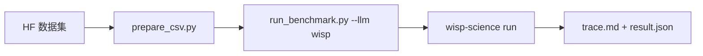

[English](README.md) | **中文** · [↑ wisp-science-benchmark](../README.zh.md)

# Wisp 在 CompBioBench 上的评测

本目录 **就是** 评测体系：Genentech runner（MIT，见 `LICENSE.compbiobench-runner`）加上一等公民 `wisp` backend。数据仍放在 git 外面。

CompBioBench 要求 **单行 exact string match**；本 runner 负责收集输出和合并结果，未实现正确性评分。不能和 BiomniBench-DA 的 rubric LLM judge 横比。



环境变量模板见 [`.env.example`](.env.example)。

## 布局

| 路径 | 角色 |
| --- | --- |
| `run_benchmark.py` | Harness（从 [`compbiobench-runner`](https://github.com/Genentech/compbiobench-runner) 搬来）+ `LLM_PROVIDERS` 里的 `wisp` |
| `wisp_provider.py` / `wisp-run.sh` | 驱动 `wisp-science run --output jsonl` |
| `prepare_csv.py` | 把 `file_paths` 改成本地数据目录 |
| `environment.yml` | 每题 clone 的基础 conda 环境 |
| [`Genentech/compbiobench-data-v1`](https://huggingface.co/datasets/Genentech/compbiobench-data-v1) | 题目 + 数据文件（另外下载） |
| [`wisp-science`](https://github.com/xuzhougeng/wisp-science) | 被测 agent |

---

## 准备

### 数据集（Hugging Face 镜像）

```bash
mkdir -p ~/benchmark
cd ~/benchmark
export HF_ENDPOINT=https://hf-mirror.com
# export HF_TOKEN=hf_xxxxxx   # 若 gated
# huggingface-cli login --token "$HF_TOKEN"

huggingface-cli download Genentech/compbiobench-data-v1 \
  --local-dir ./compbiobench-data \
  --repo-type dataset
```

根目录应有 `compbiobench.v1.tsv`，文件在 `data/`。

### conda 环境 + Wisp 二进制

```bash
cd /ABS/PATH/wisp-science-benchmark/compbiobench
conda env create -f environment.yml   # 名字：compbio-benchmark

export PATH="$HOME/.cargo/bin:$PATH"
cd ~/benchmark/wisp-science
cargo build --release -p wisp-cli
```

### 题目 CSV

```bash
python prepare_csv.py \
  --data-dir ~/benchmark/compbiobench-data \
  --out benchmark.csv
```

`--strict` 在缺文件时退出。

### Benchmark / Benchmark-full

两档共用已下载的 `compbiobench-data` 和完整的 `benchmark.csv`，在运行前筛选题目。已有题目输入的大小不影响筛选；关注的是输入之外还需要获取的大型参考数据库、参考基因组和索引。

| 档位 | 参数 | 范围 |
| --- | --- | --- |
| Benchmark（默认） | `--profile default`，可省略 | 暂时跳过下面 5 题；100 题输入会选中 95 题 |
| Benchmark-full | `--profile full` | 保留输入 CSV 中全部题目 |

第一版人工名单保存在 [`FULL_ONLY_QUESTIONS`](run_benchmark.py)，按常规分析所需的外部资源和已有下载阻塞记录划分：

| 暂时仅在 full 运行 | 额外资源；题目输入已下载 |
| --- | --- |
| `contaminated-rna-q1/q2/q3` | 未知污染物分类所用的综合参考库，例如 Kraken2 数据库 |
| `encode-atac-pipeline-q1` | ENCODE ATAC 管线的参考数据包和比对索引 |
| `find-deletion-q1` | hg38 基因组序列和比对索引 |

这是一份暂定的资源筛选名单，不代表这些题的所有解法都必须下载大文件，也不保证默认集完全离线或不会超时。`pooled-infer-donors-q1`、`tissue-fibroblast-q1`、`odd-one-out-q1` 的 BAM/RDS/压缩包已经提供，保留在默认集；API 查询、元数据检索、长计算和安装等待不作为自动排除理由。后续需核对原始工具调用再扩充名单，不根据某个模型是否答对或超时来选题。

只预览名单，不启动模型、不创建 Conda 环境：

```bash
python run_benchmark.py run --llm wisp -i benchmark.csv --list-questions
python run_benchmark.py run --llm wisp -i benchmark.csv --profile full --list-questions
```

这是本仓库定义的子集，不是官方 CompBioBench 新版本。结果目录名包含 profile；`run_metadata.json` 记录 profile、名单版本、选中 ID、跳过理由及实际题数。两档应分别报告，默认集跳过的题不计为模型失败。`--exclude` 仍可额外排除题目，但会改变实际评测范围。

---

## 跑

脚本 **不加载** `.env`，先 source。一个进程一个模型（`WISP_MODEL` 必须等于 `-m`）。

```bash
cd /ABS/PATH/wisp-science-benchmark/compbiobench
set -a; source .env; set +a

# 冒烟
python run_benchmark.py run --llm wisp -m "$WISP_MODEL" -i test_benchmark.csv -n 1

# Benchmark：默认跳过上面的 5 道外部参考数据题
python run_benchmark.py run --llm wisp -m "$WISP_MODEL" -i benchmark.csv -n 1 -t 120

# Benchmark-full：包含这些题目
python run_benchmark.py run --llm wisp -m "$WISP_MODEL" -i benchmark.csv -n 1 -t 120 --profile full
```

先 `-n 1`。conda clone 很重。

Wisp 用克隆环境的 `bin/` 拼进 `PATH` 启动（不用 `conda run`，后者可能整段 `-t` 都零输出）。进程 180 秒没有任何输出会被杀掉并重试一次（`BENCH_STARTUP_SILENCE_SEC=0` 关闭）。PyPI 不通时设 `UV_INDEX_URL`（`wisp-run.sh` 里 `UV_HTTP_TIMEOUT` 默认 30）。

续跑：

```bash
python run_benchmark.py run --llm wisp -m "$WISP_MODEL" --resume wisp_<model>_<timestamp>
```

续跑使用实际目录名，自动继承原 profile；旧版没有 profile 的运行按 full 处理。不能把 full 原地续跑成 default，应新建运行。默认名单版本变化时也需要新建运行。

分别合并两档，避免混用题目分母和结果：

```bash
python run_benchmark.py merge -i benchmark.csv --profile default -o benchmark_results.csv
python run_benchmark.py merge -i benchmark.csv --profile full -o benchmark_results-full.csv
```

`merge` 只读取同档、同默认名单版本的运行；合并旧版结果需要 `--profile full`。

日志的 `[DONE]`（旧版为 `[OK]`）仅表示返回了未标为 `ERROR` 的输出，不能当作答对。`result.json` 中的 `status: success` 也是执行状态；“Safest next action”等文字仍可能被记录为输出。正确率需另行依据标准答案核对。Wisp 未配置模型价格，日志中的 `$0.0000` 也不能证明实际调用免费。

跑完可以把 run 目录拷进 `reports/<run-id>/`。

### Wisp 环境变量

和 BiomniBench 同一套。Headless 不走桌面密钥环。

| 变量 | 作用 |
| --- | --- |
| `WISP_BIN` | `wisp-science` 的绝对路径 |
| `WISP_ROOT` | 源码树（`python/kernel_worker.py`、`skills/`） |
| `WISP_PROVIDER` | 线协议：`openai` / `openai_responses` / `anthropic` |
| `WISP_API_URL` | API **根地址**（Wisp 自己补路径） |
| `WISP_MODEL` | 模型 ID，必须等于 `--model` |
| `WISP_API_KEY` | 服务商 key |
| `WISP_VISION` | `1` = 发送原生图片 part |

Harness 每题 clone `compbio-benchmark`。Wisp 通过 `PATH` 使用克隆环境，其他 backend 使用 `conda run --live-stream`。Kernel REPL 仍是每题 uv venv（和 BiomniBench-DA 一样）。
