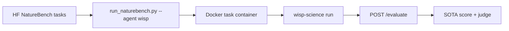

**English** | [中文](README.zh.md) · [↑ wisp-science-benchmark](../README.md)

# Wisp on NatureBench

How we evaluate [wisp-science](https://github.com/xuzhougeng/wisp-science) on [NatureBench](https://github.com/FrontisAI/NatureBench): a thin `AgentAdapter`, not a fork of the harness and not a NatureBench feature inside Wisp.

NatureBench asks a coding agent to solve scientific ML problems distilled from Nature-family papers and scores the run against the paper's reported SOTA (Match-SOTA / Surpass-SOTA), plus a post-hoc validity judge. That is **not** comparable to BiomniBench-DA (rubric judge) or CompBioBench (one-line exact match).

Official custom-agent path: [`docs/custom-agents.md`](https://github.com/FrontisAI/NatureBench/blob/main/docs/custom-agents.md) (Path B).



Copy [`.env.example`](.env.example).

## Layout

| Path | Role |
| --- | --- |
| [`FrontisAI/NatureBench`](https://github.com/FrontisAI/NatureBench) | Official harness (clone under `~/benchmark/`, not in this git repo) |
| [`FrontisAI/NatureBench`](https://huggingface.co/datasets/FrontisAI/NatureBench) | Task packages |
| `wisp_adapter.py` | `AgentAdapter` (`--agent wisp`) |
| `install_adapter.py` | Copy the adapter into the NatureBench clone |
| [`wisp-science`](https://github.com/xuzhougeng/wisp-science) | Agent under test |

Do **not** vendor NatureBench here (Docker images, eval sidecars, 90 task packages).

---

## Setup

```bash
mkdir -p ~/benchmark
cd ~/benchmark
git clone https://github.com/FrontisAI/NatureBench.git
git clone https://github.com/xuzhougeng/wisp-science.git   # if needed

cd NatureBench
conda env create -f conda_env.yml
conda env create -f conda_env_eval.yml
conda activate naturebench

python /ABS/PATH/wisp-science-benchmark/naturebench/install_adapter.py \
  --naturebench-dir ~/benchmark/NatureBench
```

Build Wisp:

```bash
export PATH="$HOME/.cargo/bin:$PATH"
cd ~/benchmark/wisp-science
cargo build --release -p wisp-cli
```

The host binary is bind-mounted into the container. It must be executable **inside** the NatureBench image (glibc). If the host build does not run there, bake a matching binary into a derived image later.

Download tasks (HF mirror):

```bash
export HF_ENDPOINT=https://hf-mirror.com
cd ~/benchmark/NatureBench
python run_naturebench.py \
  --tasks task-set/naturebench-25/cpu.txt \
  --download-only
```

---

## Run

`run_naturebench.py` does **not** load `.env`. Source it first. Official comparable runs disable web search and use a **4 hour** solve budget.

Start with NatureBench-25 **cpu** (1 task), then `gpu_low` if you have a 24 GB GPU (3090/4090 class). `gpu_high` wants A800/A100. Without a GPU you cannot match the published board.

```bash
set -a
source /ABS/PATH/wisp-science-benchmark/naturebench/.env
set +a

cd ~/benchmark/NatureBench
conda activate naturebench

python run_naturebench.py \
  --tasks task-set/naturebench-25/cpu.txt \
  --agent wisp \
  --model "$WISP_MODEL" \
  --out-dir ./results/wisp_${WISP_MODEL}_nb25_cpu \
  --start-eval-services \
  --eval-env-mapping ./eval_env_mapping.json \
  --ensure-base-image
```

GPU low (NatureBench-25):

```bash
python run_naturebench.py \
  --tasks task-set/naturebench-25/gpu_low.txt \
  --agent wisp \
  --model "$WISP_MODEL" \
  --out-dir ./results/wisp_${WISP_MODEL}_nb25_gpu_low \
  --gpu-devices 0 \
  --max-workers 1 \
  --timeout 14400 \
  --start-eval-services \
  --eval-env-mapping ./eval_env_mapping.json \
  --ensure-base-image
```

Copy finished runs into `naturebench/reports/<run-id>/` when you want them in git.

### Wisp env vars

Same identity knobs as the other suites. `extra_env` forwards them into the container; `--model` overrides `WISP_MODEL`.

| Variable | Role |
| --- | --- |
| `WISP_BIN` | Host path to `wisp-science` (mounted read-only) |
| `WISP_ROOT` | Host source tree (`python/kernel_worker.py`, `skills/`) |
| `WISP_PROVIDER` / `WISP_API_URL` / `WISP_API_KEY` | LLM wire protocol |
| `WISP_MODEL` | Must equal `--model` |
| `JUDGE_*` | Post-hoc validity judge (official board used GPT-5.5) |

The Claude prompt reused here forbids using files outside `/task/problem/`. Do not enable extra web tools if you want scores comparable to the official table.
