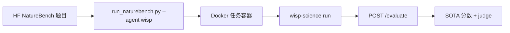

[English](README.md) | **中文** · [↑ wisp-science-benchmark](../README.zh.md)

# Wisp 在 NatureBench 上的评测

本目录说明如何在 [NatureBench](https://github.com/FrontisAI/NatureBench) 上评测 [wisp-science](https://github.com/xuzhougeng/wisp-science)：一层薄 `AgentAdapter`，不 fork harness，也不把 NatureBench 写进 Wisp。

NatureBench 要 coding agent 解从 Nature 系论文抽出的科学 ML 题，分数对照论文 SOTA（Match-SOTA / Surpass-SOTA），外加事后 validity judge。**不能**和 BiomniBench-DA（rubric judge）或 CompBioBench（单行 exact match）横比。

官方自定义 agent 路径：[`docs/custom-agents.md`](https://github.com/FrontisAI/NatureBench/blob/main/docs/custom-agents.md)（Path B）。



环境变量模板见 [`.env.example`](.env.example)。

## 布局

| 路径 | 角色 |
| --- | --- |
| [`FrontisAI/NatureBench`](https://github.com/FrontisAI/NatureBench) | 官方 harness（clone 到 `~/benchmark/`，不进本 git 仓库） |
| [`FrontisAI/NatureBench`](https://huggingface.co/datasets/FrontisAI/NatureBench) | 任务包 |
| `wisp_adapter.py` | `AgentAdapter`（`--agent wisp`） |
| `install_adapter.py` | 把 adapter 拷进 NatureBench clone |
| [`wisp-science`](https://github.com/xuzhougeng/wisp-science) | 被测 agent |

**不要**把整份 NatureBench 搬进本仓库（Docker 镜像、eval sidecar、90 个 task package）。

---

## 准备

```bash
mkdir -p ~/benchmark
cd ~/benchmark
git clone https://github.com/FrontisAI/NatureBench.git
git clone https://github.com/xuzhougeng/wisp-science.git   # 若还没有

cd NatureBench
conda env create -f conda_env.yml
conda env create -f conda_env_eval.yml
conda activate naturebench

python /ABS/PATH/wisp-science-benchmark/naturebench/install_adapter.py \
  --naturebench-dir ~/benchmark/NatureBench
```

编译 Wisp：

```bash
export PATH="$HOME/.cargo/bin:$PATH"
cd ~/benchmark/wisp-science
cargo build --release -p wisp-cli
```

宿主机二进制会 bind-mount 进容器，必须能在 NatureBench 镜像里跑（glibc）。宿主机编出来的跑不起来时，再做成派生镜像。

下题目（HF 镜像）：

```bash
export HF_ENDPOINT=https://hf-mirror.com
cd ~/benchmark/NatureBench
python run_naturebench.py \
  --tasks task-set/naturebench-25/cpu.txt \
  --download-only
```

---

## 跑

`run_naturebench.py` **不加载** `.env`，先 source。官方可比配置关 web search，解题时限 **4 小时**。

先跑 NatureBench-25 的 **cpu**（1 题），有 24GB GPU（3090/4090 档）再上 `gpu_low`。`gpu_high` 要 A800/A100。没 GPU 对不上官方榜。

```bash
set -a
source /ABS/PATH/wisp-science-benchmark/naturebench/.env
set +a

cd ~/benchmark/NatureBench
conda activate naturebench

python run_naturebench.py \
  --tasks task-set/naturebench-25/cpu.txt \
  --agent wisp \
  --model "$WISP_MODEL" \
  --out-dir ./results/wisp_${WISP_MODEL}_nb25_cpu \
  --start-eval-services \
  --eval-env-mapping ./eval_env_mapping.json \
  --ensure-base-image
```

GPU low（NatureBench-25）：

```bash
python run_naturebench.py \
  --tasks task-set/naturebench-25/gpu_low.txt \
  --agent wisp \
  --model "$WISP_MODEL" \
  --out-dir ./results/wisp_${WISP_MODEL}_nb25_gpu_low \
  --gpu-devices 0 \
  --max-workers 1 \
  --timeout 14400 \
  --start-eval-services \
  --eval-env-mapping ./eval_env_mapping.json \
  --ensure-base-image
```

跑完可以把 run 拷进 `naturebench/reports/<run-id>/`。

### Wisp 环境变量

和另外两套同一套身份变量。`extra_env` 传进容器；`--model` 覆盖 `WISP_MODEL`。

| 变量 | 作用 |
| --- | --- |
| `WISP_BIN` | 宿主机 `wisp-science`（只读挂进容器） |
| `WISP_ROOT` | 宿主机源码树（`python/kernel_worker.py`、`skills/`） |
| `WISP_PROVIDER` / `WISP_API_URL` / `WISP_API_KEY` | LLM 线协议 |
| `WISP_MODEL` | 必须等于 `--model` |
| `JUDGE_*` | 事后 validity judge（官方榜用过 GPT-5.5） |

这里复用 Claude 的任务 prompt，禁止使用 `/task/problem/` 以外的文件。要对齐官方表，不要再给 Wisp 开额外网页工具。
