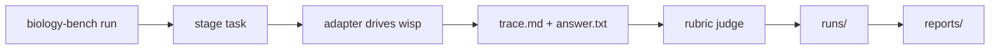

**English** | [中文](README.zh.md) · [↑ wisp-science-benchmark](../README.md)

# Wisp on BiomniBench-DA

This suite documents how we evaluate [wisp-science](https://github.com/xuzhougeng/wisp-science) on [BiomniBench-DA](https://huggingface.co/datasets/phylobio/BiomniBench-DA): environment, local patches, model-comparison protocol, and how to run / report.

The three working trees live under `~/benchmark/` (not inside this repo). Commands below assume that layout. Copy [`.env.example`](.env.example) from this directory.

## Overview

| Repo | Role | What it does |
| --- | --- | --- |
| [`BiomniBench-AI4S`](https://github.com/omicverse/BiomniBench-AI4S) | Harness | Ships the `biology-bench` CLI (`fetch` / `run` / `smoke` / `report`). Runs a backend × task matrix: stage a task workspace → drive the agent via an adapter to produce `trace.md` + `answer.txt` → call the shared judge. Backends are declared in `configs/backends.yaml`; each maps to a thin adapter in `src/biology_bench/adapters/*.py`. Raw artifacts go to `runs/`, leaderboards to `reports/`, selected traces to `trajectories/`. |
| [`OmicOS-BiomniBench`](https://github.com/omicverse/OmicOS-BiomniBench) (`omicos-biomnibench`) | Dataset loader + grader | Imported in-place by the harness (bridged via `_biomni.py`, not vendored). `dataset.py` loads and stages BiomniBench-DA tasks/rubrics; `grader.py` is the rubric LLM judge (each criterion scored A/B/C, looked up, summed, and normalized to 0–1; pass threshold ≥ 0.70; default DeepSeek, with Anthropic/Gemini fallback). Its own CLI/runner is unused in this flow. `results/` and `analysis/` are historical score archives. |
| [`wisp-science`](https://github.com/xuzhougeng/wisp-science) | Agent under test | Open-source, local-first scientific agent (Rust). The harness drives the headless `wisp-science` binary through `scripts/wisp-run.sh` over interactive stdin (one-line prompt + `/q`). `python/kernel_worker.py` is the persistent Python kernel (the probe checks that this file exists). LLM access is via `WISP_API_KEY` / `WISP_MODEL` / `WISP_API_URL` / `WISP_PROVIDER`. |

The harness does **not** vendor the grader. It finds the second repo through `OMICOS_BIOMNIBENCH_ROOT`. Wisp is located via `WISP_ROOT` (must contain `python/kernel_worker.py` and `skills/`) and `WISP_BIN`.

One-line data flow:

`biology-bench run` → per cell, stage the task from omicos-biomnibench → adapter drives the agent in the workspace to write `trace.md` + `answer.txt` → omicos-biomnibench rubric judge scores the cell → raw artifacts in `runs/` → leaderboard in `reports/`.



---

## Environment setup

### Clone the three repos

```bash
cd ~/benchmark

git clone https://github.com/omicverse/BiomniBench-AI4S.git
git clone https://github.com/omicverse/OmicOS-BiomniBench.git omicos-biomnibench
git clone https://github.com/xuzhougeng/wisp-science.git
```

### Python evaluation environment

Package name and CLI are both `biology-bench`.

```bash
cd ~/benchmark/BiomniBench-AI4S
uv venv .venv --python 3.13
source .venv/bin/activate
uv pip install -e . -e ../omicos-biomnibench
biology-bench --help
```

### Download the Hugging Face dataset (gated)

Dataset: <https://huggingface.co/datasets/phylobio/BiomniBench-DA>

1. Sign in with the **same account** that will own `HF_TOKEN`.
2. Open the dataset page, accept the terms, and wait until the account is on the access list.
3. A live token that is **not** on the list still gets `GatedRepoError` 403 and `fetch` downloads 0 files.

```bash
cd ~/benchmark/BiomniBench-AI4S

export HF_ENDPOINT=https://hf-mirror.com
export HF_TOKEN=hf_xxxxxx

huggingface-cli login --token $HF_TOKEN

huggingface-cli download phylobio/BiomniBench-DA \
  --local-dir ./data/biomnibench-da \
  --repo-type dataset
```

Files land in `~/benchmark/BiomniBench-AI4S/data/biomnibench-da/` (50 `da-*` directories, each with `environment/` + `instruction.md` + `tests/rubric.txt`).

The grader’s default data root is `omicos-biomnibench/data/` (`dataset.py` → `_data_dir()`), which is **not** the download path above. `.env` must set `OMICOS_BIOMNIBENCH_DATA_DIR` to `~/benchmark/BiomniBench-AI4S/data` — the **parent** of `biomnibench-da/`.

### Build the Wisp headless CLI

```bash
export PATH="$HOME/.cargo/bin:$PATH"
rustup default 1.88

cd ~/benchmark/wisp-science
cargo build --release -p wisp-cli
# artifact: target/release/wisp-science

test -x target/release/wisp-science && test -f python/kernel_worker.py && echo OK
```

The probe checks two things only: the binary is executable, and `$WISP_ROOT/python/kernel_worker.py` exists.

### Scientific Python environment (`OSCI_KERNEL_BIN`)

Task text says “Python 3 and R are pre-installed; Install any additional packages you need”. Wisp’s kernel REPL, however, creates a **fresh uv venv per task workspace** (kernel/MCP deps only) with no scientific stack.

`OSCI_KERNEL_BIN` prepends a scientific env’s `bin/` to `PATH`, so the agent’s **shell** (`python file.py`, `pip`) hits the big packages, and it also pins the kernel venv’s base Python.

Local env used here: `~/benchmark/envs/omicdev/` (CPython 3.12, managed by uv).

Packages chosen from the 50 tasks’ actual file formats and analysis types:

- Core: numpy / pandas / scipy / scikit-learn / statsmodels / matplotlib / seaborn
- Single-cell / bioinformatics: scanpy / anndata (`.h5ad`) / h5py (`.h5`) / pysam (`.bam`/`.bai`) / pyreadr (`.RData`) / gseapy / pydeseq2 / harmonypy / python-igraph / leidenalg / umap-learn
- I/O: openpyxl (`.xlsx`) / xlrd (`.xls`) / pyarrow / tables / zarr
- Other: adjusttext / upsetplot / networkx / tqdm

```bash
cd ~/benchmark
uv venv envs/omicdev --python 3.12 --seed
UV_INDEX_URL=https://pypi.tuna.tsinghua.edu.cn/simple \
uv pip install --python envs/omicdev/bin/python \
  numpy pandas scipy matplotlib seaborn scikit-learn statsmodels \
  scanpy anndata h5py pysam pyreadr gseapy pydeseq2 harmonypy \
  python-igraph leidenalg umap-learn \
  openpyxl xlrd pyarrow tables zarr adjusttext upsetplot networkx tqdm
```

Sanity check:

```bash
~/benchmark/envs/omicdev/bin/python -c \
  "import scanpy, anndata, pysam, pyreadr, pydeseq2, gseapy, sklearn, statsmodels; print('OK')"
```

Notes:

- `import scanpy` still fails inside the kernel REPL (`python` tool): that process runs in each task’s `.wisp/python/.venv`, which has no system packages. Scientific packages go through the **shell path** (`python script.py`). The system prompt allows this.
- Packages the agent `pip install`s in the shell land in omicdev (front of `PATH`) and **accumulate across tasks**.
- R is provided by the system (`/usr/local/bin/Rscript`; wisp’s `find_rscript` finds it). Task `.RData` files can also be read from Python with pyreadr.

---

## Model comparison: swap the agent model, keep the DeepSeek judge

Judge and agent are decoupled. The judge is controlled by `configs/models.yaml` + `DEEPSEEK_API_KEY`; the agent is controlled by `WISP_*`. Fix the judge and only change the agent model, so score deltas are attributable to the agent and can be aligned with the official leaderboard.

### Two local patches (not in the upstream repos)

**1. `scripts/wisp-run.sh`**

The `run` section hard-codes four `WISP_*` exports and would overwrite whatever you exported (forcing DeepSeek). Keep existing values instead (behavior matches upstream when only `DEEPSEEK_*` is set):

```bash
export WISP_API_KEY="${WISP_API_KEY:-${DEEPSEEK_API_KEY:-}}"
export WISP_PROVIDER="${WISP_PROVIDER:-openai}"
export WISP_MODEL="${WISP_MODEL:-$MODEL}"
export WISP_API_URL="${WISP_API_URL:-${DEEPSEEK_API_BASE:-https://api.deepseek.com/v1}}"
```

**2. `src/biology_bench/matrix.py`**

Resume completed cells and delete the workspace after grading. Without this, all 50 workspaces stay on disk and a crashed run cannot continue.

Next to `import json`, add `import shutil`. After `cell_dir.mkdir(...)` and **before** `stage_task`, insert:

```python
existing = cell_dir / "grade.json"
if existing.is_file() and not import_only:
    data = json.loads(existing.read_text(encoding="utf-8"))
    fields = set(CellResult.__dataclass_fields__)
    _emit(f"[matrix] resume {backend_id}/{task.task_id} "
          f"status={data.get('status')} score={data.get('score')}")
    return CellResult(**{k: data[k] for k in fields if k in data})
```

After writing `grade.json` and **before** `return cell`, insert:

```python
for _name in ("trace.md", "answer.txt"):
    src = workspace / _name
    if src.is_file():
        shutil.copy2(src, cell_dir / _name)
try:
    shutil.rmtree(workspace)
except Exception as e:
    _emit(f"[matrix] workspace cleanup failed for {task.task_id}: {e}")
```

### Judge config (identical for every run)

Leave `configs/models.yaml` at the upstream default. Do not change it:

```yaml
judge_model:
  provider: deepseek
  model: deepseek-v4-pro
```

Set `DEEPSEEK_API_KEY` / `DEEPSEEK_API_BASE` in `.env`. **Do not set `ANTHROPIC_API_KEY` / `GEMINI_API_KEY`.** If DeepSeek jitters, the grader fallback chain would silently send some cells to another judge. Mixed judges inside one run make cross-model comparison invalid.

### Agent config: one model, one run

After patch 1, `WISP_*` env vars take precedence over the wisp `model.model` in `backends.yaml` (that field is only a fallback; leave it). Env vars are process-global, so **different models cannot share a run**. Use a separate run per model and put the model name in `--run-id` (`grade.json` does not record the agent model; the run-id is the only traceable place).

#### Wisp CLI environment variables

Headless `wisp-science` is configured only by environment variables (the desktop keyring is not used). Identity vars select the model; the rest are optional knobs. A Kimi run looks like this:

```bash
export WISP_PROVIDER=anthropic
export WISP_API_URL=https://api.kimi.com/coding/
export WISP_MODEL=kimi-k3
export WISP_VISION=1
#export WISP_REASONING_EFFORT=none
#export WISP_MAX_TOKENS=32768
#export WISP_MAX_ITER=200
```

| Variable | Role |
| --- | --- |
| `WISP_PROVIDER` | Wire protocol, not the vendor name: `openai` (default, `/chat/completions`), `openai_responses` (`/v1/responses`), or `anthropic` (`/v1/messages`). Kimi Coding speaks Anthropic Messages, so `anthropic`. |
| `WISP_API_URL` | API **root**. Wisp appends the path itself — do **not** add `/v1`, `/chat/completions`, or `/v1/messages`. That is why Kimi is `https://api.kimi.com/coding/` here, while a Kimi **judge** base must end with `/v1`. Defaults: DeepSeek / OpenAI / Anthropic depending on provider. |
| `WISP_MODEL` | Model id the endpoint actually accepts (`kimi-k3`, `deepseek-v4-flash`, …). |
| `WISP_API_KEY` | Provider API key. Required. |
| `WISP_VISION` | `1` = the model accepts native image parts, so `view_image` / kernel figures are sent as image content instead of being stripped or described by a separate vision model. Kimi has vision; we set this. |
| `WISP_REASONING_EFFORT` | Thinking intensity on the wire (`none` / `low` / `medium` / `high` / `max`; Anthropic goes in `output_config.effort`, OpenAI-compatible in `reasoning_effort`). Unset = provider default. Leave commented unless you need to force `none` (no thinking) or a specific tier. |
| `WISP_MAX_TOKENS` | Max **output** tokens per model call (CLI default 8192). Unset unless long tool-using turns are truncated (`finish_reason: length`). |
| `WISP_MAX_ITER` | Max agent tool-loop iterations per turn (default 100; `0` = unlimited). After the cap, Wisp still sends one no-tools wrap-up request. Unset unless a hard task burns the default 100. |

Commented lines in the snippet are optional overrides we do **not** set for the default Kimi run. Uncomment them only when you need that knob.

Shared `.env` (`.gitignore` already lists `.env`; `chmod 600`; never commit):

```bash
HF_TOKEN=hf_...
WISP_BIN=/ABS/PATH/wisp-science/target/release/wisp-science
WISP_ROOT=/ABS/PATH/wisp-science
OMICOS_BIOMNIBENCH_ROOT=/ABS/PATH/omicos-biomnibench
OMICOS_BIOMNIBENCH_DATA_DIR=/ABS/PATH/BiomniBench-AI4S/data   # parent of biomnibench-da/; wrong dir if unset

# judge: always DeepSeek
DEEPSEEK_API_KEY=sk-...
DEEPSEEK_API_BASE=https://api.deepseek.com/v1

# scientific Python bin/ (scanpy etc.), prepended to PATH
OSCI_KERNEL_BIN=/ABS/PATH/benchmark/envs/omicdev/bin

# WISP_MODEL for kimi
WISP_PROVIDER=anthropic
WISP_API_URL=https://api.kimi.com/coding/
WISP_MODEL=kimi-k3
WISP_API_KEY=sk-kimi-xxxx
WISP_VISION=1
# WISP_REASONING_EFFORT=none
# WISP_MAX_TOKENS=32768
# WISP_MAX_ITER=200
```

`biology-bench` does **not** auto-load `.env`. Source it first.

Smoke one task per new model (`biology-bench smoke --backends wisp --run-id smoke-<model>`) before a full run.

```bash
set -a; source .env; set +a

# Kimi (vision: wisp sends view_image / kernel figures as native image parts)
biology-bench run --backends wisp --run-id wisp-kimi-k3

# DeepSeek baseline: unset WISP_PROVIDER / WISP_API_URL / WISP_MODEL / WISP_API_KEY;
# patch 1 falls back to DEEPSEEK_*. Keep WISP_VISION if the model can see figures.
biology-bench run --backends wisp --run-id wisp-deepseek

# Other models (GLM, …): same pattern — swap identity vars + swap run-id
```

After a run finishes:

```bash
# biology-bench report <run-id>
biology-bench report wisp-kimi-k3
```

Scores from different **judge** models are not comparable. Only compare runs that share the same judge model and version.

If you must use Kimi as judge (scores will **not** be comparable to the official board), change `models.yaml` to `provider: anthropic` / `model: kimi-k3`, set `ANTHROPIC_API_KEY`, and make `ANTHROPIC_API_BASE` **end with `/v1`** (e.g. `https://api.kimi.com/coding/v1`).

The grader POSTs `{base}/messages`. Missing `/v1` is a 404. That is **not** the same value as the agent’s `WISP_API_URL=https://api.kimi.com/coding/` (no `/v1`; wisp appends the path itself).
