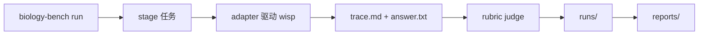

[English](README.md) | **中文** · [↑ wisp-science-benchmark](../README.zh.md)

# Wisp 在 BiomniBench-DA 上的评测流程

本目录说明我们如何在 [BiomniBench-DA](https://huggingface.co/datasets/phylobio/BiomniBench-DA) 上评测 [wisp-science](https://github.com/xuzhougeng/wisp-science)：环境准备、本地补丁、模型对比方案，以及如何跑评测 / 出报告。

三个工作树放在 `~/benchmark/` 下（不在本仓库内）。下文命令按这个布局写。环境变量模板见本目录 [`.env.example`](.env.example)。

## 概览

| Repo | 角色 | 说明 |
| --- | --- | --- |
| [`BiomniBench-AI4S`](https://github.com/omicverse/BiomniBench-AI4S) | Harness（编排层） | 提供 `biology-bench` CLI（`fetch` / `run` / `smoke` / `report`），按 backend × task 矩阵跑评测：stage 任务 workspace → 通过 adapter 驱动被测 agent 产出 `trace.md` + `answer.txt` → 调共享 judge 评分。被测 backend 在 `configs/backends.yaml` 声明，每个对应 `src/biology_bench/adapters/*.py` 一个薄适配层；原始产物落在 `runs/`，榜单落在 `reports/`，精选轨迹发布到 `trajectories/`。 |
| [`OmicOS-BiomniBench`](https://github.com/omicverse/OmicOS-BiomniBench)（`omicos-biomnibench`） | 数据集装载 + Grader | 以 Python 库形式被 harness 就地 import（`_biomni.py` 桥接，不 vendor 副本）：`dataset.py` 负责 BiomniBench-DA 题目/rubric 的装载与 staging，`grader.py` 是 rubric LLM judge（每条 criterion 判 A/B/C 等级、查表求和归一到 0–1，≥ 0.70 及格，默认 DeepSeek judge，可回落 Anthropic/Gemini）。它自带的 CLI/runner 在此流程中基本闲置；`results/`、`analysis/` 是它自己历史评测的成绩档案。 |
| [`wisp-science`](https://github.com/xuzhougeng/wisp-science) | 被测 agent（agent under test） | 开源 local-first AI 科研 agent（Rust 编写），headless 二进制 `wisp-science` 由 harness 经 `scripts/wisp-run.sh` 以交互式 stdin 方式驱动（喂单行 prompt + `/q`）；`python/kernel_worker.py` 是它的持久 Python 执行 kernel（probe 会检查它存在）。运行时通过 `WISP_API_KEY` / `WISP_MODEL` / `WISP_API_URL` / `WISP_PROVIDER` 等环境变量接入 LLM provider。 |

Harness 不 vendor grader，靠环境变量 `OMICOS_BIOMNIBENCH_ROOT` 找到第二个仓库；wisp 侧则靠 `WISP_ROOT`（其下需有 `python/kernel_worker.py` 和 `skills/`）与 `WISP_BIN` 定位。

数据流一句话：`biology-bench run` → 逐 cell 从 omicos-biomnibench stage 任务 → adapter 驱动 agent 在 workspace 里产出 `trace.md` + `answer.txt` → omicos-biomnibench 的 rubric judge 评分 → `runs/` 存原始产物 → `reports/` 出榜单。



---

## 环境准备

### 克隆三个仓库

```bash
cd ~/benchmark

git clone https://github.com/omicverse/BiomniBench-AI4S.git
git clone https://github.com/omicverse/OmicOS-BiomniBench.git omicos-biomnibench
git clone https://github.com/xuzhougeng/wisp-science.git
```

### 准备 Python 评测环境

包名是 `biology-bench`，CLI 也是 `biology-bench`。

```bash
cd ~/benchmark/BiomniBench-AI4S
uv venv .venv --python 3.13
source .venv/bin/activate
uv pip install -e . -e ../omicos-biomnibench
biology-bench --help
```

### 下载 Hugging Face 数据集（gated）

数据集：<https://huggingface.co/datasets/phylobio/BiomniBench-DA>

1. 用**即将写入 `HF_TOKEN` 的那个账号**登录。
2. 打开上面的页面，点同意条款，等到账号进授权名单。
3. Token 活着但没进名单会直接 `GatedRepoError` 403，fetch 0 文件。

```bash
cd ~/benchmark/BiomniBench-AI4S

export HF_ENDPOINT=https://hf-mirror.com
export HF_TOKEN=hf_xxxxxx

huggingface-cli login --token $HF_TOKEN

huggingface-cli download phylobio/BiomniBench-DA \
  --local-dir ./data/biomnibench-da \
  --repo-type dataset
```

成功后落在 `~/benchmark/BiomniBench-AI4S/data/biomnibench-da/`（50 个 `da-*` 目录，每个有 `environment/` + `instruction.md` + `tests/rubric.txt`）。

注意：grader 装载题目时默认找 `omicos-biomnibench/data/`（`dataset.py` 的 `_data_dir()`），与上面的下载位置不符，所以 `.env` 里必须把 `OMICOS_BIOMNIBENCH_DATA_DIR` 指到 `~/benchmark/BiomniBench-AI4S/data`（即 `biomnibench-da/` 的上一级）。

### 编译 Wisp headless CLI

```bash
export PATH="$HOME/.cargo/bin:$PATH"
rustup default 1.88

cd ~/benchmark/wisp-science
cargo build --release -p wisp-cli
# 产物：target/release/wisp-science

test -x target/release/wisp-science && test -f python/kernel_worker.py && echo OK
```

Probe 只检查两件事：二进制可执行 + `$WISP_ROOT/python/kernel_worker.py` 存在。

### 科学 Python 环境（`OSCI_KERNEL_BIN`）

题面声明 “Python 3 and R are pre-installed; Install any additional packages you need”。但 wisp 的 kernel REPL 用的是**每题 workspace 下新建的 uv venv**（只装 kernel/MCP 依赖），不带科学包。

`OSCI_KERNEL_BIN` 把一个科学环境的 `bin/` 前置到 PATH，让 agent 的 **shell** 路径（`python file.py`、`pip`）直接用到大包，也决定 kernel venv 的 base Python 版本。

本机已建好：`~/benchmark/envs/omicdev/`（CPython 3.12，uv 管理）。

包清单（按 50 题的实际数据格式 + 分析类型选定）：

- 核心栈：numpy / pandas / scipy / scikit-learn / statsmodels / matplotlib / seaborn
- 单细胞与生信：scanpy / anndata（`.h5ad`）/ h5py（`.h5`）/ pysam（`.bam`/`.bai`）/ pyreadr（`.RData`）/ gseapy / pydeseq2 / harmonypy / python-igraph / leidenalg / umap-learn
- 数据 I/O：openpyxl（`.xlsx`）/ xlrd（`.xls`）/ pyarrow / tables / zarr
- 其他：adjusttext / upsetplot / networkx / tqdm

复现命令：

```bash
cd ~/benchmark
uv venv envs/omicdev --python 3.12 --seed
UV_INDEX_URL=https://pypi.tuna.tsinghua.edu.cn/simple \
uv pip install --python envs/omicdev/bin/python \
  numpy pandas scipy matplotlib seaborn scikit-learn statsmodels \
  scanpy anndata h5py pysam pyreadr gseapy pydeseq2 harmonypy \
  python-igraph leidenalg umap-learn \
  openpyxl xlrd pyarrow tables zarr adjusttext upsetplot networkx tqdm
```

验证：

```bash
~/benchmark/envs/omicdev/bin/python -c \
  "import scanpy, anndata, pysam, pyreadr, pydeseq2, gseapy, sklearn, statsmodels; print('OK')"
```

注意事项：

- kernel REPL（agent 的 `python` 工具）里 `import scanpy` 仍会失败——它跑在每题自己的 `.wisp/python/.venv`，不带系统包。科学包走 **shell 路径**（`python script.py`），system prompt 允许这种用法。
- agent 在 shell 里 `pip install` 的包会落进 omicdev（PATH 最前），跨题累积，越跑越全。
- R 已由系统提供（`/usr/local/bin/Rscript`，wisp 的 `find_rscript` 能找到）；题目附带的 `.RData` 也可以直接用 pyreadr 从 Python 读。

---

## 模型对比方案：agent 换模型，judge 固定 DeepSeek

Judge 与 agent 是解耦的：judge 由 `configs/models.yaml` + `DEEPSEEK_API_KEY` 控制，被测 agent 由 `WISP_*` 环境变量控制。固定 judge、只换 agent 模型，分差才可归因于 agent，也才能与官方榜对齐。

### 前置：两处本地补丁（官方仓库没有）

**1. `scripts/wisp-run.sh`**

run 段四行硬编码会覆盖你 export 的 `WISP_*`（强制 DeepSeek）。改成保留已有值（只设 `DEEPSEEK_*` 时行为与官方一致）：

```bash
export WISP_API_KEY="${WISP_API_KEY:-${DEEPSEEK_API_KEY:-}}"
export WISP_PROVIDER="${WISP_PROVIDER:-openai}"
export WISP_MODEL="${WISP_MODEL:-$MODEL}"
export WISP_API_URL="${WISP_API_URL:-${DEEPSEEK_API_BASE:-https://api.deepseek.com/v1}}"
```

**2. `src/biology_bench/matrix.py`**

resume + 判完删 workspace（不打的话 50 题的 workspace 全留磁盘，中断也不能续跑）。`import json` 旁加 `import shutil`；`cell_dir.mkdir(...)` 之后、`stage_task` 之前插入：

```python
existing = cell_dir / "grade.json"
if existing.is_file() and not import_only:
    data = json.loads(existing.read_text(encoding="utf-8"))
    fields = set(CellResult.__dataclass_fields__)
    _emit(f"[matrix] resume {backend_id}/{task.task_id} "
          f"status={data.get('status')} score={data.get('score')}")
    return CellResult(**{k: data[k] for k in fields if k in data})
```

写完 `grade.json` 之后、`return cell` 之前插入：

```python
for _name in ("trace.md", "answer.txt"):
    src = workspace / _name
    if src.is_file():
        shutil.copy2(src, cell_dir / _name)
try:
    shutil.rmtree(workspace)
except Exception as e:
    _emit(f"[matrix] workspace cleanup failed for {task.task_id}: {e}")
```

### Judge 配置（所有 run 不变）

`configs/models.yaml` 保持官方默认，不要改：

```yaml
judge_model:
  provider: deepseek
  model: deepseek-v4-pro
```

`.env` 里设 `DEEPSEEK_API_KEY` / `DEEPSEEK_API_BASE`。**不要设 `ANTHROPIC_API_KEY` / `GEMINI_API_KEY`**——否则 DeepSeek 抖动时 grader 的 fallback 链会把部分 cell 悄悄切给别家 judge，同一次 run 内 judge 不一致，横向对比作废。

### Agent 配置：一个模型一个 run

wisp 的 provider / key / URL / model 全靠 `WISP_*` 环境变量（补丁 1 之后环境变量优先于 `backends.yaml` 里 wisp 的 `model.model`，后者只作兜底、不用改）。环境变量对整个 run 进程全局，所以不同模型**不能塞进同一个 run**，要分 run 跑，`--run-id` 里带模型名（`grade.json` 不记录 agent 模型，run-id 是唯一可追溯的地方）。

#### Wisp CLI 环境变量

headless `wisp-science` 只认环境变量（不用桌面端的系统密钥环）。身份四件套用来选模型，其余是可选旋钮。Kimi 的跑法：

```bash
export WISP_PROVIDER=anthropic
export WISP_API_URL=https://api.kimi.com/coding/
export WISP_MODEL=kimi-k3
export WISP_VISION=1
#export WISP_REASONING_EFFORT=none
#export WISP_MAX_TOKENS=32768
#export WISP_MAX_ITER=200
```

| 变量 | 作用 |
| --- | --- |
| `WISP_PROVIDER` | 线协议，不是厂商名：`openai`（默认，`/chat/completions`）、`openai_responses`（`/v1/responses`）、`anthropic`（`/v1/messages`）。Kimi Coding 走 Anthropic Messages，所以填 `anthropic`。 |
| `WISP_API_URL` | API **根地址**。Wisp 自己补路径——**不要**再加 `/v1`、`/chat/completions` 或 `/v1/messages`。所以这里 Kimi 是 `https://api.kimi.com/coding/`，而 Kimi 当 **judge** 时的 base 必须以 `/v1` 结尾。未设置时按 provider 回落 DeepSeek / OpenAI / Anthropic。 |
| `WISP_MODEL` | 接口真正接受的模型 ID（`kimi-k3`、`deepseek-v4-flash` 等）。 |
| `WISP_API_KEY` | 服务商 API key，必填。 |
| `WISP_VISION` | `1` = 模型接受原生图片 part，`view_image` / kernel 产出的图会作为 image content 发给模型，而不是被丢掉或先经另一个视觉模型转写。Kimi 有视觉，本评测设为 `1`。 |
| `WISP_REASONING_EFFORT` | 推理强度（`none` / `low` / `medium` / `high` / `max`；Anthropic 走 `output_config.effort`，OpenAI 兼容走 `reasoning_effort`）。不设 = 服务商默认。默认注释掉；只有需要强制关掉思考（`none`）或钉死某一档时才打开。 |
| `WISP_MAX_TOKENS` | 单次模型调用的 **输出** token 上限（CLI 默认 8192）。默认不设；只有工具轮次被截断（`finish_reason: length`）时再加大。 |
| `WISP_MAX_ITER` | 每轮 agent 工具循环的最大迭代次数（默认 100；`0` = 不限制）。触顶后 Wisp 仍会再发一次不带工具的收尾请求。默认不设；难题把 100 用尽时再调到 200。 |

示例里注释掉的行是可选覆盖，默认 Kimi run **不设**。需要对应旋钮时再取消注释。

`.env` 公共部分（gitignore 已有 `.env`，`chmod 600`，不要提交）：

```bash
HF_TOKEN=hf_...
WISP_BIN=/ABS/PATH/wisp-science/target/release/wisp-science
WISP_ROOT=/ABS/PATH/wisp-science
OMICOS_BIOMNIBENCH_ROOT=/ABS/PATH/omicos-biomnibench
OMICOS_BIOMNIBENCH_DATA_DIR=/ABS/PATH/BiomniBench-AI4S/data   # biomnibench-da/ 的上一级，不设会找错目录

# judge：固定 DeepSeek
DEEPSEEK_API_KEY=sk-...
DEEPSEEK_API_BASE=https://api.deepseek.com/v1

# 科学 Python 的 bin/（scanpy 等，见上文「科学 Python 环境」节），prepend 到 PATH
OSCI_KERNEL_BIN=/ABS/PATH/benchmark/envs/omicdev/bin

# WISP_MODEL for kimi
WISP_PROVIDER=anthropic
WISP_API_URL=https://api.kimi.com/coding/
WISP_MODEL=kimi-k3
WISP_API_KEY=sk-kimi-xxxx
WISP_VISION=1
# WISP_REASONING_EFFORT=none
# WISP_MAX_TOKENS=32768
# WISP_MAX_ITER=200
```

跑法（`biology-bench` **不自动加载** `.env`，要先 source）：

建议每个新模型先 `biology-bench smoke --backends wisp --run-id smoke-<模型>` 跑一题确认链路通了再上全量。

```bash
set -a; source .env; set +a

# Kimi（有视觉：wisp 默认把 view_image / kernel 产出的图作为原生 image part 发给模型）
biology-bench run --backends wisp --run-id wisp-kimi-k3

# DeepSeek 对照：不设 WISP_PROVIDER / WISP_API_URL / WISP_MODEL / WISP_API_KEY，
# 补丁 1 自动回落 DEEPSEEK_*，与官方行为一致。模型能看图则保留 WISP_VISION。
biology-bench run --backends wisp --run-id wisp-deepseek

# 再加其他模型（GLM 等）：同理换身份变量 + 换 run-id
```

运行结束后，使用 `report` 子命令出报告：

```bash
# biology-bench report <run-id>
biology-bench report wisp-kimi-k3
```

注意：judge 模型不同时，run-id 分数不能直接比较，只建议同一个模型的同一版本。

若确需 Kimi 当 judge（分数与官方榜不可比），把 `models.yaml` 的 judge 改为 `provider: anthropic` / `model: kimi-k3` 并设 `ANTHROPIC_API_KEY`，且 `ANTHROPIC_API_BASE` **必须**以 `/v1` 结尾（如 `https://api.kimi.com/coding/v1`）。

grader 直接 POST `{base}/messages`，少 `/v1` 会 404。这与 wisp agent 的 `WISP_API_URL=https://api.kimi.com/coding/`（不带 v1，wisp 自己补路径）不是同一个值。
